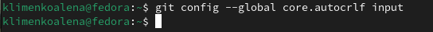

---
## Front matter
title: "ОТЧЕТ ПО ЛАБОРАТОРНОЙ РАБОТЕ №2"
subtitle: "Дисциплина: Архитектура компьютеров и операционные системы"
author: "Клименко Алёна Сергеевна"

## Generic otions
lang: ru-RU
toc-title: "Содержание"

## Bibliography
bibliography: bib/cite.bib
csl: pandoc/csl/gost-r-7-0-5-2008-numeric.csl

## Pdf output format
toc: true # Table of contents
toc-depth: 2
lof: true # List of figures
lot: true # List of tables
fontsize: 12pt
linestretch: 1.5
papersize: a4
documentclass: scrreprt
## I18n polyglossia
polyglossia-lang:
  name: russian
  options:
	- spelling=modern
	- babelshorthands=true
polyglossia-otherlangs:
  name: english
## I18n babel
babel-lang: russian
babel-otherlangs: english
## Fonts
mainfont: IBM Plex Serif
romanfont: IBM Plex Serif
sansfont: IBM Plex Sans
monofont: IBM Plex Mono
mathfont: STIX Two Math
mainfontoptions: Ligatures=Common,Ligatures=TeX,Scale=0.94
romanfontoptions: Ligatures=Common,Ligatures=TeX,Scale=0.94
sansfontoptions: Ligatures=Common,Ligatures=TeX,Scale=MatchLowercase,Scale=0.94
monofontoptions: Scale=MatchLowercase,Scale=0.94,FakeStretch=0.9
mathfontoptions:
## Biblatex
biblatex: true
biblio-style: "gost-numeric"
biblatexoptions:
  - parentracker=true
  - backend=biber
  - hyperref=auto
  - language=auto
  - autolang=other*
  - citestyle=gost-numeric
## Pandoc-crossref LaTeX customization
figureTitle: "Рис."
tableTitle: "Таблица"
listingTitle: "Листинг"
lofTitle: "Список иллюстраций"
lotTitle: "Список таблиц"
lolTitle: "Листинги"
## Misc options
indent: true
header-includes:
  - \usepackage{indentfirst}
  - \usepackage{float} # keep figures where there are in the text
  - \floatplacement{figure}{H} # keep figures where there are in the text
---

# Цель работы

Целью работы является изучить идеологию и применение средств контроля версий. Приобрести практические навыки по работе с системой git.

# Задание

    1. Настройка GitHub.
    2. Базовая настройка Git.
    3. Создание SSH-ключа.
    4. Создание рабочего пространства и репозитория курса на основе шаблона.
    5. Создание репозитория курса на основе шаблона.
    6. Настройка каталога курса.
    7. Выполнение заданий для самостоятельной работы

# Теоретическое введение

Системы контроля версий (Version Control System, VCS) применяются при работе нескольких человек над одним проектом. Обычно основное дерево проекта хранится в локальном или удалённом репозитории, к которому настроен доступ для участников проекта. При внесении изменений в содержание проекта система контроля версий позволяет их фиксировать, совмещать изменения, произведённые разными участниками проекта, производить откат к любой более ранней версии проекта, если это требуется. В классических системах контроля версий используется централизованная модель, предполагающая наличие единого репозитория для хранения файлов. Выполнение большинства функций по управлению версиями осуществляется специальным сервером. Участник проекта (пользователь) перед началом работы посредством определённых команд получает нужную ему версию файлов. После внесения изменений, пользователь размещает новую версию в хранилище. При этом предыдущие версии не удаляются из центрального хранилища и к ним можно вернуться в любой момент. Сервер может сохранять не полную версию изменённых файлов, а производить так называемую дельта-компрессию — сохранять только изменения между последовательными версиями, что позволяет уменьшить объём хранимых данных. Системы контроля версий поддерживают возможность отслеживания и разрешения конфликтов, которые могут возникнуть при работе нескольких человек над одним файлом. Можно объединить (слить) изменения, сделанные разными участниками (автоматически или вручную), вручную выбрать нужную версию, отменить изменения вовсе или заблокировать файлы для изменения. В зависимости от настроек блокировка не позволяет другим пользователям получить рабочую копию или препятствует изменению рабочей копии файла средствами файловой системы ОС, обеспечивая таким образом, привилегированный доступ только одному пользователю, работающему с файлом. Системы контроля версий также могут обеспечивать дополнительные, более гибкие функциональные возможности. Например, они могут поддерживать работу с несколькими версиями одного файла, сохраняя общую историю изменений до точки ветвления версий и собственные истории изменений каждой ветви. Кроме того, обычно доступна информация о том, кто из участников, когда и какие изменения вносил. Обычно такого рода информация хранится в журнале изменений, доступ к которому можно ограничить. В отличие от классических, в распределённых системах контроля версий центральный репозиторий не является обязательным. Среди классических VCS наиболее известны CVS, Subversion, а среди распределённых — Git, Bazaar, Mercurial. Принципы их работы схожи, отличаются они в основном синтаксисом используемых в работе команд. Система контроля версий Git представляет собой набор программ командной строки. Доступ к ним можно получить из терминала посредством ввода команды git с различными опциями. Благодаря тому, что Git является распределённой системой контроля версий, резервную копию локального хранилища можно сделать простым копированием или архивацией. Работа пользователя со своей веткой начинается с проверки и получения изменений из центрального репозитория (при этом в локальное дерево до начала этой процедуры не должно было вноситься изменений). Затем можно вносить изменения в локальном дереве и/или ветке. После завершения внесения какого-то изменения в файлы и/или каталоги проекта необходимо разместить их в центральном репозитории.
# Выполнение лабораторной работы

Создала учетную запись на сайте GitHub и заполнила основные данные учетной записи.(рис. [-@fig:001]).

{#fig:001 width=70%}
Открываю виртуальную машину, затем открываю терминал и делаю предварительную конфигурацию git. Ввожу команду git config –global user.name “”, указывая свое имя и команду git config –global user.email “work@mail”, указывая в ней электронную почту (рис. [-@fig:002]).

{#fig:002 width=70%}
Настраиваю utf-8 в выходе сообщений git. (рис. [-@fig:003]). Задаю имя начальной ветки, которую буду называть master(рис. [-@fig:003]).

{#fig:003 width=70%}
А также ввожу autocrlf (рис. [-@fig:004]).

{#fig:004 width=70%}
ввожу safecrlf (рис. [-@fig:005]).

{#fig:005 width=70%}
Для последующей идентификации пользователя на сервере репозиториев генерирую пару ключей (приватный и открытый). (рис. [-@fig:006]).

{#fig:006 width=70%}
Чтобы скопировать из локальной консоли ключ в буфер обмена, устанавливаю команду xclip (рис. [-@fig:007]).

{#fig:007 width=70%}
Теперь воспользуюсь командой xclip (рис. [-@fig:008]).

{#fig:008 width=70%}
Вставляю ключ в появившееся на сайте поле и указываю его имя. (рис. [-@fig:009]).

{#fig:009 width=70%}
Открываю терминал и создаю репозиторий для предмета «Архитектура компьютера».(рис. [-@fig:010]).

{#fig:010 width=70%}
Захожу на страницу репозитория с шаблоном курса, выбираю его в качестве своего нового. (рис. [-@fig:011]).

{#fig:011 width=70%}
Далее создаю его и задаю ему имя. (рис. [-@fig:012]).

{#fig:012 width=70%}
Проверяю корректность создания (рис. [-@fig:013]).

{#fig:013 width=70%}
Клонирую созданный репозиторий (рис. [-@fig:014]).

{#fig:014 width=70%}
Перехожу в каталог курса(рис. [-@fig:015]) и удаляю лишний файлы. (рис. [-@fig:015])

{#fig:015 width=70%}
{#fig:016 width=70%}
Создаю необходимые каталоги, отправляю файлы на сервер. (рис. [-@fig:016]).(рис. [-@fig:017]).

{#fig:017 width=70%}
{#fig:016 width=70%}
Создаю отчет по выполнению второй лабораторной работы в соответствующем каталоге. С помощью команды ls проверяю, создан ли файл. (рис. [-@fig:018]).

{#fig:018 width=70%}
проверяю местонахождение своих лабораторных работ. (рис. [-@fig:019]).

{#fig:019 width=70%}
Копирую лабораторную работу с помощью утилиты cp, проверяю местонахождение файлов с помощью команды ls. (рис. [-@fig:020]).

{#fig:020 width=70%}
Для того чтобы загрузить эти файлы на GitHub, в первую очередь я использую команду git add. Так добавленные мной файлы станут отслеживаемыми. (рис. [-@fig:001]).

{#fig:021 width=70%}
Теперь осуществляю полноценный перенос файлов(рис. [-@fig:022]).

{#fig:022 width=70%}
Использую команды: git status и git push, чтобы опубликовать свои локальные коммиты. (рис. [-@fig:023]).

{#fig:023 width=70%}
Перехожу в каталоги на GitHub, чтобы убедиться в том, что файлы находятся в нужных репозиториях. (рис. [-@fig:024]).

{#fig:024 width=70%}

# Выводы
 В заключение хочется отметить, что данная лабораторная работа позволила мне научиться работать с системой Git. Я практиковала свои навыки в работе с командной строкой, теперь уже связывая выполнимое с директориями GitHub.

# Список литературы{.unnumbered}
[1) Туис]<https://esystem.rudn.ru/course/view.php?id=112>
[2) githab]<https://github.com/>
::: {#refs}
:::
