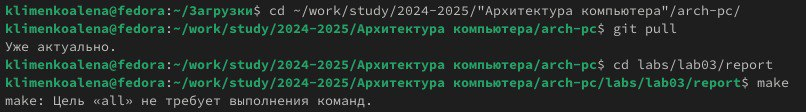
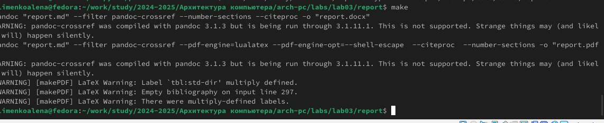
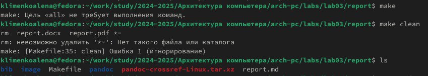
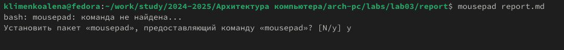
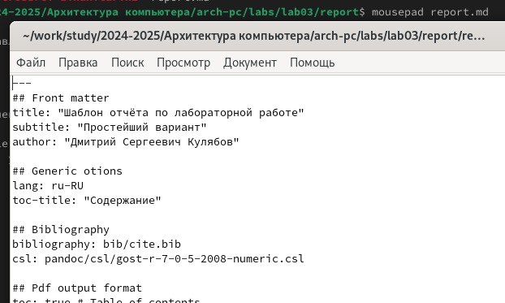
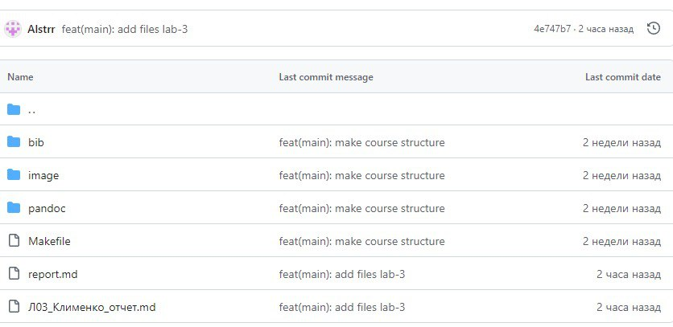

---
## Front matter
title: "Отчёт по лабороторной работе №3"
subtitle: "дисциплина: Архитектура компьютера"
author: "Клименко Алёна Сергеевна"

## Generic otions
lang: ru-RU
toc-title: "Содержание"

## Bibliography
bibliography: bib/cite.bib
csl: pandoc/csl/gost-r-7-0-5-2008-numeric.csl

## Pdf output format
toc: true # Table of contents
toc-depth: 2
lof: true # List of figures
lot: true # List of tables
fontsize: 12pt
linestretch: 1.5
papersize: a4
documentclass: scrreprt
## I18n polyglossia
polyglossia-lang:
  name: russian
  options:
	- spelling=modern
	- babelshorthands=true
polyglossia-otherlangs:
  name: english
## I18n babel
babel-lang: russian
babel-otherlangs: english
## Fonts
mainfont: IBM Plex Serif
romanfont: IBM Plex Serif
sansfont: IBM Plex Sans
monofont: IBM Plex Mono
mathfont: STIX Two Math
mainfontoptions: Ligatures=Common,Ligatures=TeX,Scale=0.94
romanfontoptions: Ligatures=Common,Ligatures=TeX,Scale=0.94
sansfontoptions: Ligatures=Common,Ligatures=TeX,Scale=MatchLowercase,Scale=0.94
monofontoptions: Scale=MatchLowercase,Scale=0.94,FakeStretch=0.9
mathfontoptions:
## Biblatex
biblatex: true
biblio-style: "gost-numeric"
biblatexoptions:
  - parentracker=true
  - backend=biber
  - hyperref=auto
  - language=auto
  - autolang=other*
  - citestyle=gost-numeric
## Pandoc-crossref LaTeX customization
figureTitle: "Рис."
tableTitle: "Таблица"
listingTitle: "Листинг"
lofTitle: "Список иллюстраций"
lotTitle: "Список таблиц"
lolTitle: "Листинги"
## Misc options
indent: true
header-includes:
  - \usepackage{indentfirst}
  - \usepackage{float} # keep figures where there are in the text
  - \floatplacement{figure}{H} # keep figures where there are in the text
---

# Цель работы

Целью данной лабораторной работы является освоение процедуры оформления отчетов с помощью легковесного языка разметки Markdown.

# Задание

1. Установка необходимого ПО
2. Заполнение отчета по выполнению лабораторной работы №4 с помощью языка разметки Markdown
3. Задание для самостоятельной работы

# Теоретическое введение

Markdown - легковесный язык разметки, созданный с целью обозначения форматирования в простом тексте, с максимальным сохранением его читаемости человеком, и пригодный для машинного преобразования в языки для продвинутых публикаций. 
Внутритекстовые формулы делаются аналогично формулам LaTeX.
В Markdown вставить изображение в документ можно с помощью непосредственного указания адреса изображения.
Синтаксис Markdown для встроенной ссылки состоит из части [link text], представляющей текст гиперссылки, и части (file-name.md) – URL-адреса или имени файла, на который дается ссылка.
Markdown поддерживает как встраивание фрагментов кода в предложение, так и их размещение между предложениями в виде отдельных огражденных блоков. Огражденные блоки кода — это простой способ выделить синтаксис для фрагментов кода.

# Выполнение лабораторной работы

## Заполнение отчета по выполнению лабораторной работы №3 с помощью языка разметки Markdown

Открываю терминал. Перехожу в каталог курса, сформированный при выполненнии прошлой лаборатной работы (рис. [-@fig:1]).

{ #fig:1 width=70% }

Провожу компиляцию шаблона с помощью команды make (рис. -@fig:2), проверяю корректность исполнения команды с помощью команды ls (рис. -@fig:3)

{#fig:2 width=70%}
{#fig:3 width=70%}

После проверки работоспособности компилятора шаблонов, я удаляю сгенерированные файлы с помощью команды make clean (рис. -@fig:4)

{#fig:4 width=70%}

Скачиваю редакор, чтобы выполнить в нём отчёт (рис. -@fig:5)
С помощью редактора выполняю отчет по выполненной лабораторной работе (рис. -@fig:6)

{#fig:5 width=70%}

{#fig:6 width=70%}

## Задания для самостоятельной работы

Аналогично выполнению отчета по текующей лабораторной работе, я выполняю отчет в markdown и по второй лабораторной работе, для этого перехожу в директорию 2 лабораторной работы и готовлю отчет с помощью текстового редактора mousepad. (рис. -@fig:7)

{#fig:7 width=70%}

# Выводы

В результате выполнения данной лабораторной работы я освоила процедуры оформления отчетов с помощью легковесного языка разметки Markdown.

1. [Курс на ТУИС](https://esystem.rudn.ru/course/view.php?id=112)
2. [Лабораторная работа №3](https://esystem.rudn.ru/pluginfile.php/2089083/mod_resource/content/0/%D0%9B%D0%B0%D0%B1%D0%BE%D1%80%D0%B0%D1%82%D0%BE%D1%80%D0%BD%D0%B0%D1%8F%20%D1%80%D0%B0%D0%B1%D0%BE%D1%82%D0%B0%20%E2%84%963.%20%D0%AF%D0%B7%D1%8B%D0%BA%20%D1%80%D0%B0%D0%B7%D0%BC%D0%B5%D1%82%D0%BA%D0%B8%20.pdf)

::: {#refs}
:::
