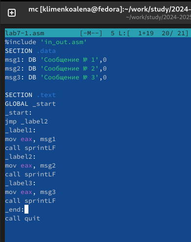

---
## Front matter
title: "Отчет по лабораторной работе №7"
subtitle: "Дисциплина: Архитектура компьютера"
author: "Клименко Алена Сергеевна"

## Generic otions
lang: ru-RU
toc-title: "Содержание"

## Bibliography
bibliography: bib/cite.bib
csl: pandoc/csl/gost-r-7-0-5-2008-numeric.csl

## Pdf output format
toc: true # Table of contents
toc-depth: 2
lof: true # List of figures
lot: true # List of tables
fontsize: 12pt
linestretch: 1.5
papersize: a4
documentclass: scrreprt
## I18n polyglossia
polyglossia-lang:
  name: russian
  options:
	- spelling=modern
	- babelshorthands=true
polyglossia-otherlangs:
  name: english
## I18n babel
babel-lang: russian
babel-otherlangs: english
## Fonts
mainfont: IBM Plex Serif
romanfont: IBM Plex Serif
sansfont: IBM Plex Sans
monofont: IBM Plex Mono
mathfont: STIX Two Math
mainfontoptions: Ligatures=Common,Ligatures=TeX,Scale=0.94
romanfontoptions: Ligatures=Common,Ligatures=TeX,Scale=0.94
sansfontoptions: Ligatures=Common,Ligatures=TeX,Scale=MatchLowercase,Scale=0.94
monofontoptions: Scale=MatchLowercase,Scale=0.94,FakeStretch=0.9
mathfontoptions:
## Biblatex
biblatex: true
biblio-style: "gost-numeric"
biblatexoptions:
  - parentracker=true
  - backend=biber
  - hyperref=auto
  - language=auto
  - autolang=other*
  - citestyle=gost-numeric
## Pandoc-crossref LaTeX customization
figureTitle: "Рис."
tableTitle: "Таблица"
listingTitle: "Листинг"
lofTitle: "Список иллюстраций"
lotTitle: "Список таблиц"
lolTitle: "Листинги"
## Misc options
indent: true
header-includes:
  - \usepackage{indentfirst}
  - \usepackage{float} # keep figures where there are in the text
  - \floatplacement{figure}{H} # keep figures where there are in the text
---

# Цель работы

Изучение команд условного и безусловного переходов. Приобретение навыков написания
программ с использованием переходов. Знакомство с назначением и структурой файла
листинга.

# Задание

1. Реализация переходов в NASM
2. Изучение структуры файлов листинга
3. Самостоятельное написание программ по материалам лабораторной работы

# Теоретическое введение

Для реализации ветвлений в ассемблере используются так называемые команды передачи
управления или команды перехода. Можно выделить 2 типа переходов:
• условный переход – выполнение или не выполнение перехода в определенную точку
программы в зависимости от проверки условия.
• безусловный переход – выполнение передачи управления в определенную точку про-
граммы без каких-либо условий.

# Выполнение лабораторной работы

## Реализация переходов в NASM

Создаю каталог для программ лабораторной работы №7, перехожу в него, создаю файл lab7-1.asm и проверяю его наличие. (рис. -@fig:001).

{#fig:001 width=70%}

Заполняю в файл lab7-1.asm код из листинга 7.1, чтобы посмотреть как будет работать jmp. (рис. -@fig:002).

{ #fig:002 width=70% }

Создаю исполняемый файл и запускаю его. Результат совпадает с тем, что находится в лабораторной работе. (рис. [-@fig:003]).

{ #fig:003 width=70% }

После изменения кода в файле запускаю его. (рис. [-@fig:004]).

{ #fig:004 width=70% }

Далее меняю код, чтобы он выводил то, что указано в задании. (рис. [-@fig:005]).

{ #fig:005 width=70% }

```NASM
%include 'in_out.asm'

SECTION .data
msg1: DB 'Сообщение № 1',0
msg2: DB 'Сообщение № 2',0
msg3: DB 'Сообщение № 3',0

SECTION .text
GLOBAL _start
_start:

jmp _label3

_label1:
mov eax, msg1
call sprintLF
jmp _end

_label2:
mov eax, msg2
call sprintLF
jmp _label1

_label3:
mov eax, msg3
call sprintLF
jmp _label2

_end:
call quit

```
Проверяю корректность написания и вывода. (рис. [-@fig:006]).

{ #fig:006 width=70% }

Создаю файл lab7-2.asm и после изучения листинга 7.3 ввожу код в файл. (рис. [-@fig:007]).

{ #fig:007 width=70% }

Несколько раз проверяю корректность работы. (рис. [-@fig:008]).

{ #fig:008 width=70% }

## Изучение структуры файла листинга

Открываю файл листинга с помощью текстового редактора mousepad. (рис. [-@fig:009]).

В листинге есть три столбца, не считая первый, в котором просто номер строки. 
Первый отвечает за адрес строки в файле asm, номер строки указан в шестнадцетеричной системе. 
Во втором столбце находится машинный код.
В третьем находится исходный текст программы. 
Рассмотрю это на конкретных строках кода, например, 8,9,10
8,9,10 - номер строки в листинге
00000003, 00000006, 00000009 - обозначают на какой строке кода находится команда, последовательность не постоянна потому что в коде есть пустые строки
803800, 7403, 40 - обозначение команды машинным кодом
cmp... ,0, jz finished, inc eax - текст программы

{ #fig:009 width=70%} 

Убираю один операнд. (рис. [-@fig:010]).

{ #fig:010 width=70% }

В листинге добавляетс отображение ошибки. (рис. [-@fig:011]).

{ #fig:011 width=70% }

## Задания для самостоятельной работы

Как я поняла я должна решить такой же вариант как и в 6 лабораторной работе, это - 2 вариант
Написала программу для нахождения наименьшего числа из 3. (рис. -@fig:012).
во время написания кода, у меня возникли сомнения надо ли вводить  число B с клавиатуры, поэтому я сделала два варианта написания кода. (рис. -@fig:013).

{ #fig:012 width=70% }

Код первой программы:

```NASM
%include 'in_out.asm'
section .data
msg1 db "Наименьшее число: ",0h
A dd '82'
B dd '59'
C dd '61'
section .bss
min resb 10

section .text
global _start
_start:

mov eax,A
call atoi 
mov [A],eax 

mov eax,B
call atoi 
mov [B],eax 

mov eax,C
call atoi 
mov [C],eax 

mov ecx,[A] ; ecx = A
mov [min],ecx ; min = A

cmp ecx,[C] ; A ? C
jb check_B ; if A < C |-> check_B
mov ecx,[C] ; if A > C |-> ecx = C
mov [min],ecx ; min = C

check_B:
mov ecx,[min] ; ecx = min(A/C)
cmp ecx,[B] ; A/C ? B
jb fin ; if A/C < B |-> fin
mov ecx,[B] ; if A/C > B |-> ecx = B
mov [min],ecx ; min = B

fin:
mov eax, msg1 ; eax = msg1
call sprint ; вывод
mov eax,[min] ; eax = min
call iprintLF ; вывод
call quit
```
{ #fig:013 width=70% }

```NASM
%include 'in_out.asm'
section .data
msg db 'Введите B: ', 0h
msg1 db 'Наименьшее число: ',0h
A dd '82'

C dd '61'

section .bss
min resb 10
B resb 10

section .text
global _start
_start:

mov eax, msg
call sprint

mov ecx, B
mov edx, 10
call sread

mov eax,A
call atoi 
mov [A],eax 

mov eax,B
call atoi 
mov [B],eax 

mov eax,C
call atoi 
mov [C],eax 

mov ecx,[A] ; ecx = A
mov [min],ecx ; min = A

cmp ecx,[C] ; A ? C
jb check_B ; if A < C |-> check_B
mov ecx,[C] ; if A > C |-> ecx = C
mov [min],ecx ; min = C

check_B:
mov ecx,[min] ; ecx = min(A/C)
cmp ecx,[B] ; A/C ? B
jb fin ; if A/C < B |-> fin
mov ecx,[B] ; if A/C > B |-> ecx = B
mov [min],ecx ; min = B

fin:
mov eax, msg1 ; eax = msg1
call sprint ; вывод
mov eax,[min] ; eax = min
call iprintLF ; вывод
call quit
```

Проверяю корректность работы кода первого варианта. (рис. [-@fig:014]).

{ #fig:014 width=70%} 

Проверяю корректность работы кода второго варианта. (рис. [-@fig:015]).

{ #fig:015 width=70%} 

Написала программу, которая для двух введенных с клавиатуры значение вычисляет требуемое значение и выводит результат. (рис. -@fig:016).

{#fig:016 width=70%}

Код второй программы:

```NASM
%include 'in_out.asm'
SECTION .data
msg1: DB 'Введите значение переменной x: ',0
msg2: DB 'Введите значение переменной a: ',0
res: DB 'Результат: ',0
SECTION .bss
x: RESB 80
a: RESB 80
SECTION .text
GLOBAL _start
_start:


mov eax, msg1
call sprint
mov ecx, x
mov edx, 80
call sread
mov eax,x
call atoi
mov edi,eax 

mov eax, msg2
call sprint
mov ecx, a
mov edx, 80
call sread
mov eax,a
call atoi
mov esi,eax


cmp esi,edi
jg var2 ; a > x |-> var2

mov eax,x
call atoi

add eax, -1
mov edi,eax ; edi = aex
jmp fin

var2:
mov eax,a
call atoi
add eax, -1
mov edi, eax ; edi = aex


fin:
mov eax,res ; eax = res
call sprint ; строка
mov eax,edi ; eax = edi
call iprintLF
call quit
```

Проверяю корректность работы кода. (рис. -@fig:017).

{#fig:017 width=70%}


# Выводы

При выполнении лабораторной работы я изучила команды условных и безусловных переходов, а также приобрела навыки написания программ с использованием переходов, познакомилась
с назначением и структурой файлов листинга.

# Список литературы{.unnumbered}

1. [Курс на ТУИС](https://esystem.rudn.ru/course/view.php?id=112)
2. [Лабораторная работа №7](https://esystem.rudn.ru/pluginfile.php/2089087/mod_resource/content/0/%D0%9B%D0%B0%D0%B1%D0%BE%D1%80%D0%B0%D1%82%D0%BE%D1%80%D0%BD%D0%B0%D1%8F%20%D1%80%D0%B0%D0%B1%D0%BE%D1%82%D0%B0%20%E2%84%967.%20%D0%9A%D0%BE%D0%BC%D0%B0%D0%BD%D0%B4%D1%8B%20%D0%B1%D0%B5%D0%B7%D1%83%D1%81%D0%BB%D0%BE%D0%B2%D0%BD%D0%BE%D0%B3%D0%BE%20%D0%B8%20%D1%83%D1%81%D0%BB%D0%BE%D0%B2%D0%BD%D0%BE%D0%B3%D0%BE%20%D0%BF%D0%B5%D1%80%D0%B5%D1%85%D0%BE%D0%B4%D0%BE%D0%B2%20%D0%B2%20Nasm.%20%D0%9F%D1%80%D0%BE%D0%B3%D1%80%D0%B0%D0%BC%D0%BC%D0%B8%D1%80%D0%BE%D0%B2%D0%B0%D0%BD%D0%B8%D0%B5%20%D0%B2%D0%B5%D1%82%D0%B2%D0%BB%D0%B5%D0%BD%D0%B8%D0%B9.pdf)

