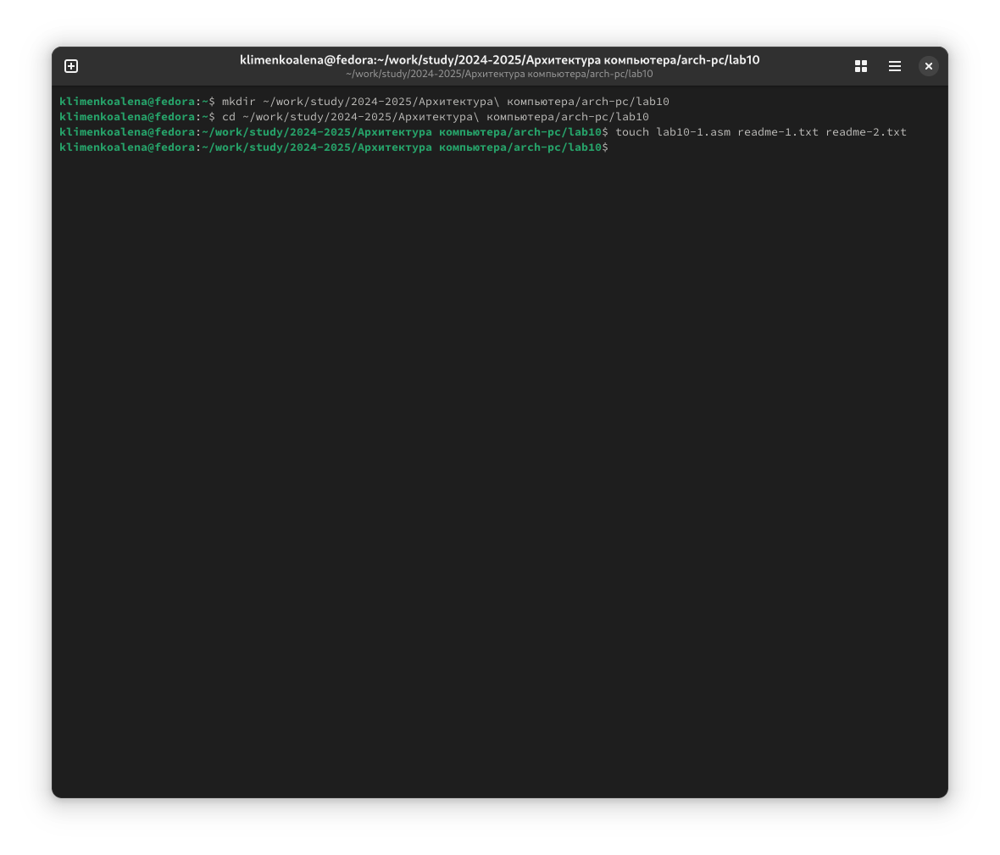
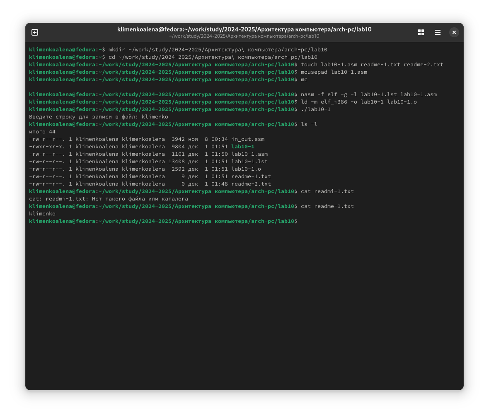
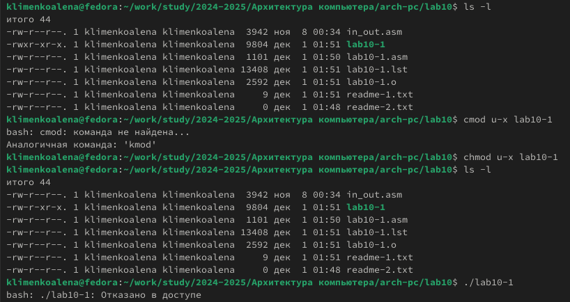
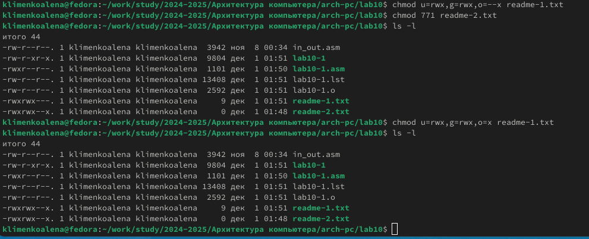

---
## Front matter
title: "Отчет по лабораторной работе №10"
subtitle: "дисциплина: Архитектура компьютера"
author: "Клименко Алёна Сергеевна"

## Generic otions
lang: ru-RU
toc-title: "Содержание"

## Bibliography
bibliography: bib/cite.bib
csl: pandoc/csl/gost-r-7-0-5-2008-numeric.csl

## Pdf output format
toc: true # Table of contents
toc-depth: 2
lof: true # List of figures
lot: true # List of tables
fontsize: 12pt
linestretch: 1.5
papersize: a4
documentclass: scrreprt
## I18n polyglossia
polyglossia-lang:
  name: russian
  options:
	- spelling=modern
	- babelshorthands=true
polyglossia-otherlangs:
  name: english
## I18n babel
babel-lang: russian
babel-otherlangs: english
## Fonts
mainfont: IBM Plex Serif
romanfont: IBM Plex Serif
sansfont: IBM Plex Sans
monofont: IBM Plex Mono
mathfont: STIX Two Math
mainfontoptions: Ligatures=Common,Ligatures=TeX,Scale=0.94
romanfontoptions: Ligatures=Common,Ligatures=TeX,Scale=0.94
sansfontoptions: Ligatures=Common,Ligatures=TeX,Scale=MatchLowercase,Scale=0.94
monofontoptions: Scale=MatchLowercase,Scale=0.94,FakeStretch=0.9
mathfontoptions:
## Biblatex
biblatex: true
biblio-style: "gost-numeric"
biblatexoptions:
  - parentracker=true
  - backend=biber
  - hyperref=auto
  - language=auto
  - autolang=other*
  - citestyle=gost-numeric
## Pandoc-crossref LaTeX customization
figureTitle: "Рис."
tableTitle: "Таблица"
listingTitle: "Листинг"
lofTitle: "Список иллюстраций"
lotTitle: "Список таблиц"
lolTitle: "Листинги"
## Misc options
indent: true
header-includes:
  - \usepackage{indentfirst}
  - \usepackage{float} # keep figures where there are in the text
  - \floatplacement{figure}{H} # keep figures where there are in the text
---

# Цель работы

Приобретение навыков написания программ для работы с файлами.

# Задание

1. Создание файлов в программах
2. Изменение прав на файлы для разных групп пользователей
3. Выполнение самостоятельных заданий по материалам лабораторной работы.

# Теоретическое введение

ОС GNU/Linux является многопользовательской операционной системой. И для обеспече-
ния защиты данных одного пользователя от действий других пользователей существуют
специальные механизмы разграничения доступа к файлам. Кроме ограничения доступа, дан-
ный механизм позволяет разрешить другим пользователям доступ данным для совместной
работы.

# Выполнение лабораторной работы

Создаю каталог для программ лабораторной работы № 10 (рис. -@fig:001).

{#fig:001 width=70%}

Ввожу в созданный файл программу из первого листинга (рис. -@fig:002).

{#fig:002 width=70%}

Запускаю программу, она просит на ввод строку, 
после чего создает текстовый файл с введенной пользователем строкой (рис. -@fig:003).

{#fig:003 width=70%}

Меняю права владельца, запретив исполнять файл, 
после чего система отказывает в исполнении файла, 
т.к. я - владелец - запретил самому себе же исполнять програму (рис. -@fig:004).

{#fig:004 width=70%}

Добавляю к исходному файлу программы права владельцу на исполнение, исполняемый текстовый файл интерпретирует каждую строку как команду, 
так как ни одна из строк не является командой bash, программа абсолютно ничего не делает (рис. -@fig:005).

{#fig:005 width=70%}

Согласно своему варианту, мне нужно установить соответсвующие ему права на текстовые файлы, созданные в начале лабораторной работы:

1. В символьном виде для 1-го readme файла rwx rwx --x
2. В двоичной системе для 2-го readme файла 110 111 101

Перевожу группу битов в восьмеричную систему, 
символьную запись подгоняю под синтаксис и получаю нужные аргументы для chmod (рис. -@fig:006).  

{#fig:006 width=70%}

2. В двоичной системе для 2-го readme файла 110 111 101 (рис. -@fig:008).  

{#fig:008 width=70%}

## Задание для самостоятельной работы

Пишу программу, транслириую и компилирую. Программа должна выводить приглашение, 
просить ввод с клавиатуры и создавать текстовый файл с указанной в программе строкой и вводом пользователя.
Запускаю программу, проверяю наличие и содержание созданного текстого файла, программа работает корректно (рис. -@fig:007).

{#fig:007 width=70%}

Код программы: 

```NASM
%include 'in_out.asm'

SECTION .data
filename db 'name.txt', 0
prompt db 'Как Вас зовут?', 0
intro db 'Меня зовут ', 0

SECTION .bss
name resb 255

SECTION .text
global _start
_start:
mov eax, prompt
call sprint

mov ecx, name
mov edx, 255
call sread

mov eax, 8
mov ebx, filename
mov ecx, 0744o
int 80h

mov esi, eax

mov eax, intro
call slen
mov edx, eax
mov ecx, intro
mov ebx, esi
mov eax, 4
int 80h

mov eax, name
call slen
mov edx, eax
mov ecx, name
mov ebx, esi
mov eax, 4
int 80h

mov ebx, esi
mov eax, 6
int 80h

call quit
```

# Выводы

В процессе выполнения лабораторной работы я приобрела навыки написания программ для работы с файлами, научилась редактировать права для файлов.


# Список литературы{.unnumbered}

1. [Курс на ТУИС](https://esystem.rudn.ru/course/view.php?id=112)

::: {#refs}
:::
